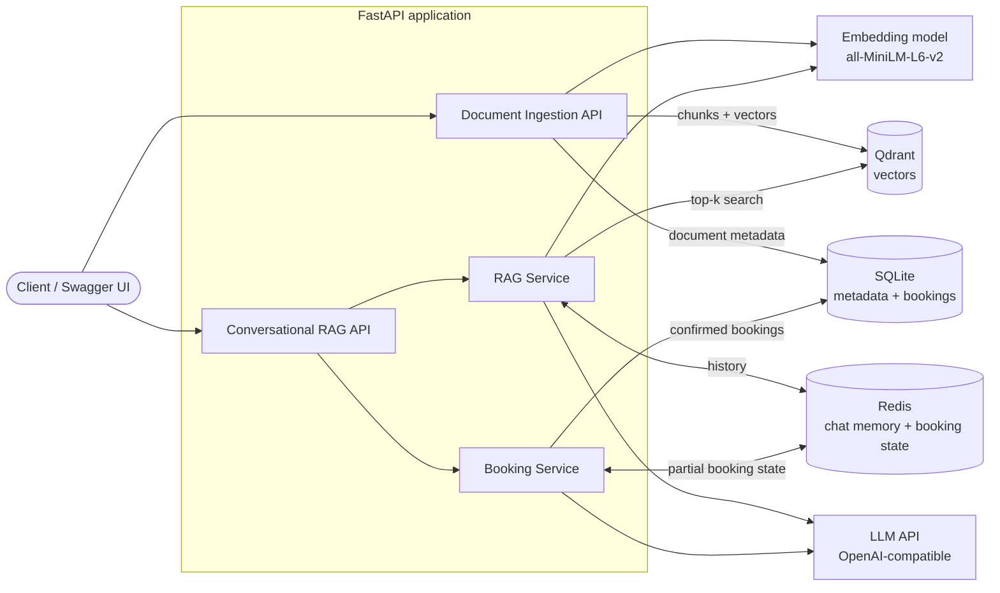
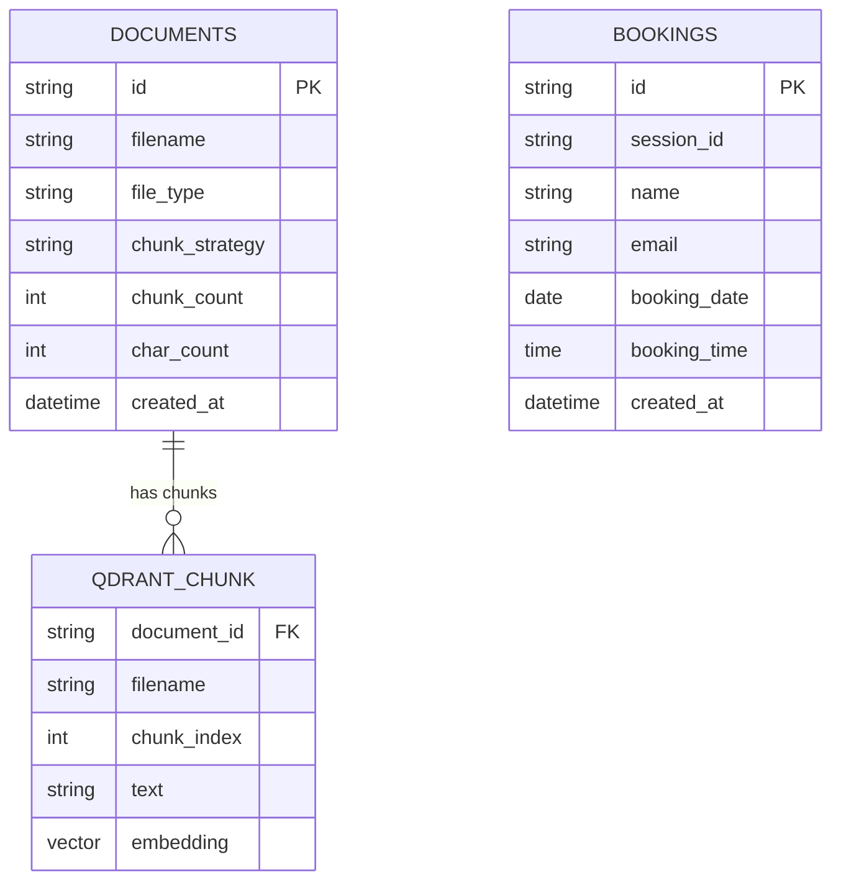
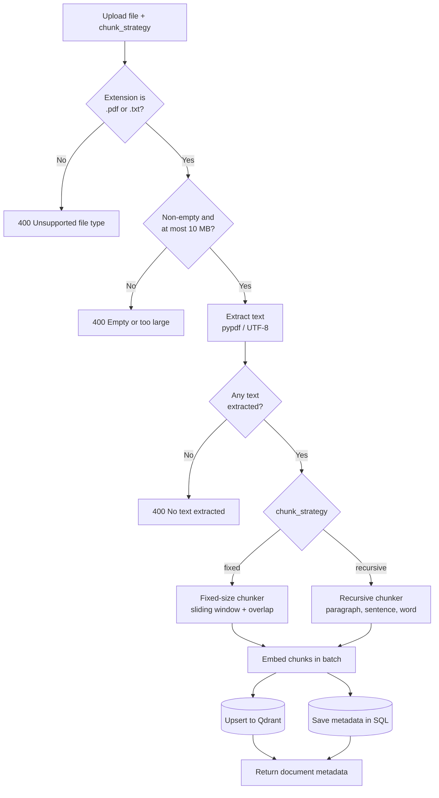
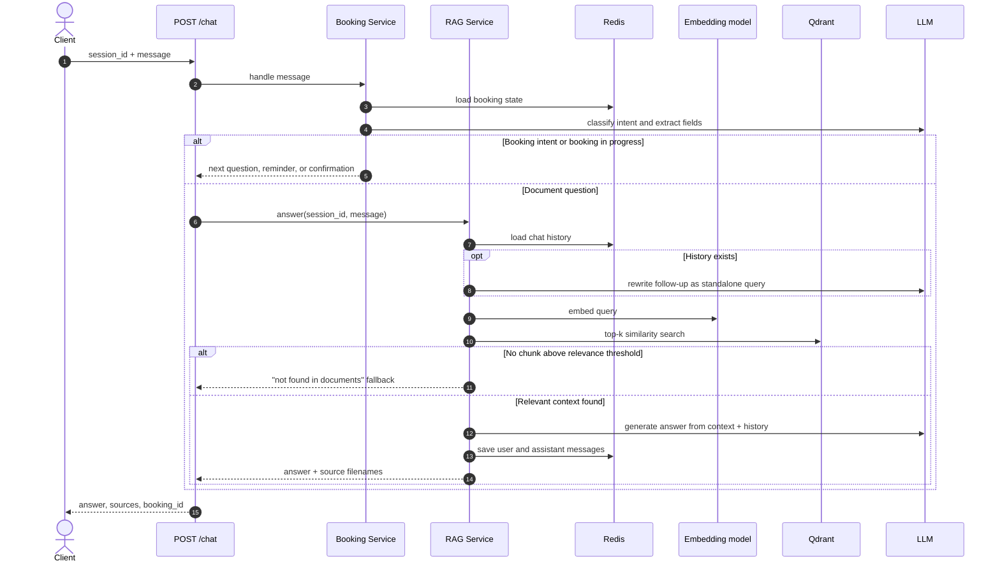
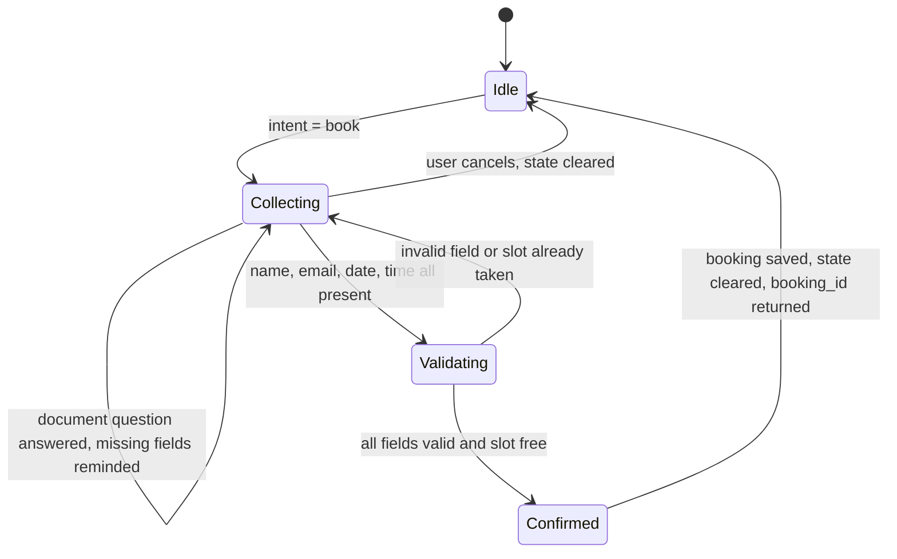

# Palm Mind RAG Backend

A FastAPI backend with two REST APIs:

1. **Document Ingestion API**: upload `.pdf` / `.txt` files, extract text, chunk it with one of two selectable strategies, embed the chunks, and store them in Qdrant. Document metadata is saved in SQL.
2. **Conversational RAG API**: a custom retrieval-augmented chat pipeline (no `RetrievalQAChain`, no LangChain chains) with Redis-backed chat memory, multi-turn handling, and LLM-driven interview booking.

There is no UI. Everything is exposed as REST endpoints, with interactive docs at `/docs`.

---

## Tech Stack

| Concern | Choice |
|---|---|
| Web framework | FastAPI + Pydantic v2 |
| Vector database | Qdrant (cosine similarity) |
| Metadata and bookings | SQLite via SQLAlchemy 2.0 |
| Chat memory and booking state | Redis |
| Embeddings | `sentence-transformers/all-MiniLM-L6-v2` (384 dimensions, runs locally) |
| LLM | Any OpenAI-compatible API (default: Groq, `openai/gpt-oss-20b`) |
| PDF extraction | `pypdf` |
| Testing | `pytest` (all external services mocked) |

Constraints respected: no FAISS, no Chroma, no `RetrievalQAChain`, no UI.

---

## Architecture

### System overview



### Project structure

```
app/
  api/            # FastAPI routers: documents, chat, bookings
  core/           # settings (pydantic-settings), database setup
  models/         # SQLAlchemy models: Document, Booking
  schemas/        # Pydantic request/response schemas
  services/       # extraction, chunking, embedding, vector_store,
                  # llm, memory, rag, booking
  repositories/   # data access: document_repository, booking_repository
  main.py         # app factory, router registration, startup
tests/            # pytest suite (mocked Redis, Qdrant, LLM, isolated SQLite)
docker-compose.yml
requirements.txt
.env.example
```

Layers are kept separate: routers handle HTTP, services hold business logic, repositories handle persistence, and dependencies are injected with FastAPI `Depends`.

## Data Model



| Store | What it holds | Key / location |
|---|---|---|
| SQLite | Document metadata, confirmed bookings | tables `documents`, `bookings` |
| Qdrant | One point per chunk: 384-dim vector + payload | collection `documents` |
| Redis | Last 10 chat messages per session (with TTL) | `chat:{session_id}` |
| Redis | Partial booking state per session (with TTL) | `booking:{session_id}` |

---

## Setup

### Prerequisites

- Python 3.11+
- Docker Desktop (for Qdrant and Redis)
- A free LLM API key (e.g. [Groq](https://console.groq.com))

### Steps

```bash
# 1. Clone
git clone https://github.com/joshipukar613-dotcom/palm-mind-rag-backend.git
cd palm-mind-rag-backend

# 2. Configure environment
cp .env.example .env          # Windows: copy .env.example .env
# edit .env and set LLM_API_KEY

# 3. Start Qdrant and Redis
docker compose up -d

# 4. Create a virtual environment and install dependencies
python -m venv .venv
source .venv/bin/activate     # Windows: .venv\Scripts\activate
pip install -r requirements.txt

# 5. Run the API
uvicorn app.main:app --reload --port 8000
```

Open **http://localhost:8000/docs** for the interactive API docs.

> On some Windows machines port 8000 is reserved by the system. If you see
> `WinError 10013`, use another port, e.g. `--port 8080`.

The first ingestion request downloads the embedding model (about 90 MB), so it takes longer than later ones.

---

## Environment Variables

Defined in `.env` (see `.env.example`):

| Variable | Default | Description |
|---|---|---|
| `DATABASE_URL` | `sqlite:///./data/app.db` | SQL database for metadata and bookings |
| `QDRANT_URL` | `http://localhost:6333` | Qdrant endpoint |
| `QDRANT_COLLECTION` | `documents` | Qdrant collection name |
| `REDIS_URL` | `redis://localhost:6379/0` | Redis endpoint |
| `CHAT_TTL_SECONDS` | `3600` | Expiry for chat history and booking state |
| `EMBEDDING_MODEL` | `sentence-transformers/all-MiniLM-L6-v2` | Local embedding model |
| `EMBEDDING_DIM` | `384` | Embedding dimension (must match the model) |
| `LLM_API_KEY` | none | API key for the LLM provider |
| `LLM_BASE_URL` | `https://api.groq.com/openai/v1` | OpenAI-compatible base URL |
| `LLM_MODEL` | `openai/gpt-oss-20b` | Chat model name |
| `CHUNK_SIZE` | `800` | Target chunk size in characters |
| `CHUNK_OVERLAP` | `100` | Overlap between chunks (fixed strategy) |
| `RETRIEVAL_MIN_SCORE` | `0.20` | Minimum cosine score for a chunk to be used as context |

Any OpenAI-compatible provider works by changing `LLM_BASE_URL`, `LLM_MODEL` and `LLM_API_KEY`.

---

## API Reference

| Method | Endpoint | Description |
|---|---|---|
| GET | `/health` | Health check |
| POST | `/api/v1/documents/ingest` | Upload and ingest a document |
| GET | `/api/v1/documents` | List ingested documents (metadata) |
| POST | `/api/v1/chat` | Send a chat message (RAG and booking) |
| DELETE | `/api/v1/chat/{session_id}` | Clear a session's history and booking state |
| GET | `/api/v1/bookings` | List stored interview bookings |

### 1. Document Ingestion API

`POST /api/v1/documents/ingest` (multipart form)

| Field | Type | Notes |
|---|---|---|
| `file` | file | `.pdf` or `.txt`, max 10 MB |
| `chunk_strategy` | string | `fixed` or `recursive` (default `recursive`) |

Pipeline:

1. Validate the file (extension, non-empty, size checked on the bytes actually read, not on headers).
2. Extract text: `pypdf` for PDFs, UTF-8 (with fallback) for text files. A PDF with no extractable text (for example, scanned images) returns a clear `400`.
3. Chunk with the selected strategy.
4. Embed all chunks in a batch.
5. Upsert vectors into Qdrant with a payload of `document_id`, `filename`, `chunk_index` and `text`.
6. Save metadata (filename, type, strategy, chunk count, character count, timestamp) in SQL.

#### Ingestion flow



```bash
curl -X POST http://localhost:8000/api/v1/documents/ingest \
  -F "file=@/path/to/document.pdf" \
  -F "chunk_strategy=recursive"

curl http://localhost:8000/api/v1/documents
```

Example response:

```json
{
  "id": "eb5bc992-90a9-4d06-996c-ed5b22ac9ecc",
  "filename": "document.pdf",
  "file_type": "pdf",
  "chunk_strategy": "recursive",
  "chunk_count": 36,
  "char_count": 22292,
  "created_at": "2026-10-06T04:30:50.132574"
}
```

#### Chunking strategies

| Strategy | How it works | Best for |
|---|---|---|
| `fixed` | Sliding window of `CHUNK_SIZE` characters with `CHUNK_OVERLAP` overlap | Predictable chunk sizes, uniform text |
| `recursive` | Splits on paragraph breaks first, then sentences, then words, merging pieces up to `CHUNK_SIZE` | Structured documents; keeps paragraphs and sentences intact |

Both are implemented in plain Python behind a common `Chunker` protocol, so adding a third strategy only requires a new class and a registry entry.

### 2. Conversational RAG API

`POST /api/v1/chat`

```json
{ "session_id": "demo1", "message": "Which is the largest planet?" }
```

Response:

```json
{
  "session_id": "demo1",
  "answer": "The largest planet in the solar system is Jupiter.",
  "sources": ["Our-Solar-System-Book.pdf"],
  "booking_id": null
}
```

#### Custom RAG pipeline (`app/services/rag.py`)

No `RetrievalQAChain` or any LangChain chain is used. Each message goes through these steps:

1. **Load history** for the `session_id` from Redis.
2. **Rewrite follow-ups.** If there is history, the LLM rewrites the message into a standalone search query using prior questions and answers, so "How many moons does it have?" becomes "How many moons does Jupiter have?".
3. **Embed** the standalone query.
4. **Retrieve** the top-k chunks from Qdrant (default k = 4) and drop hits below `RETRIEVAL_MIN_SCORE`.
5. **No-context fallback.** If nothing relevant is found, the API says so instead of letting the model guess.
6. **Generate.** A prompt is built from the retrieved context, history and question, and sent to the LLM, which is instructed to answer only from the context.
7. **Persist** the user message and answer to Redis memory, and return the answer with de-duplicated source filenames.

#### Request flow



#### Chat memory (Redis)

- Stored per session under `chat:{session_id}` as a JSON list of `{role, content}` messages.
- Only the last 10 messages are kept (sliding window).
- TTL is refreshed on every write (`CHAT_TTL_SECONDS`).
- `DELETE /api/v1/chat/{session_id}` clears history and any partial booking.

### 3. Interview booking

Booking is handled inside the same `/chat` endpoint by `BookingService` (`app/services/booking.py`).

Flow:

1. On each message, the LLM classifies intent (`book`, `cancel`, `inquiry`, `other`) and extracts `name`, `email`, `booking_date` and `booking_time` as JSON. The prompt includes today's date and weekday so relative dates like "tomorrow" or "next Monday" resolve correctly.
2. The LLM extracts only values the user explicitly stated. Anything missing stays `null`, so the system never invents an email just to finish the form.
3. Extracted fields are validated and merged into partial state stored in Redis (`booking:{session_id}`, with TTL):
   - name: at least 2 characters
   - email: valid format, normalised to lowercase
   - date: not in the past
   - time: valid 24-hour time
4. If a field is invalid, only that field is rejected and the user is asked to correct it. Valid fields are kept.
5. The user can interrupt with a document question. It is answered through the RAG pipeline, then the user is reminded which booking fields are still missing.
6. Saying "cancel" clears the booking state.
7. When all four fields are valid, the system checks for an existing booking at the same date and time. If the slot is free, it saves the booking in SQL, clears the Redis state, and returns a confirmation with `booking_id`. If the slot is taken, it asks for a different one.
8. LLM output is parsed defensively (code fences stripped, reasoning text tolerated, parse errors caught), so malformed JSON never causes a 500.

#### Booking state machine



Example conversation:

```
User: I want to book an interview
Bot:  To schedule your interview, please provide your full name, email address and preferred date and time.
User: My name is Pukar Joshi
Bot:  Thanks Pukar. I still need your email, date and time.
User: tomorrow at 3pm, email pukar@example.com
Bot:  Your interview is confirmed for Pukar Joshi on 2026-10-07 at 15:00. Booking ID: <uuid>
```

```bash
curl http://localhost:8000/api/v1/bookings
```

---

## Testing

```bash
pytest
```

The suite (85 tests) covers chunkers, extraction edge cases, upload validation (size, type, empty and image-only PDFs), the RAG service (follow-up rewriting, score filtering, fallback, source de-duplication, memory trimming and TTL), and the booking flow (multi-turn collection, invalid email, past date, short name, cancel, interruption, double booking, malformed JSON).

Tests are fully isolated: they use a temporary SQLite database and mock Qdrant, the embedding model, Redis and the LLM, so they never touch real data or the network.

---

## Design Decisions

- **Custom RAG, no chain frameworks.** Each stage is an explicit, testable step in `RagService`, as the task required.
- **Qdrant over alternatives.** It runs locally with a single Docker image, has a clear Python client, and offers a dashboard at `http://localhost:6333/dashboard` for inspecting vectors.
- **Local embeddings.** `all-MiniLM-L6-v2` needs no API key or billing, and its 384-dimension vectors are small and fast.
- **Query rewriting for follow-ups.** Retrieval works on a standalone question, not a raw pronoun-filled follow-up.
- **Relevance threshold.** Low-similarity chunks are discarded so the model says "I couldn't find that" instead of hallucinating. The threshold is configurable.
- **Redis for conversational state.** Chat history and partial bookings are short-lived data that benefits from fast access and TTL expiry.
- **SQL for durable data.** Document metadata and confirmed bookings are stored in SQLite through SQLAlchemy. Switching to PostgreSQL only requires changing `DATABASE_URL`.
- **Layered architecture.** Routers, services, repositories and schemas are separate, with dependency injection, full type hints and logging throughout.
- **Safe LLM handling.** Extraction is constrained to explicit user statements, JSON output is parsed defensively, and LLM or service outages return clear `502`/`503` errors.

---

## Known Limitations

- Scanned PDFs without a text layer are rejected (no OCR).
- Document retrieval is global: all ingested documents share one collection and there is no per-user filtering.
- Ingesting the same file twice stores duplicate chunks. Clear the collection or delete the data before re-ingesting.
- Authentication and rate limiting are not implemented.
- SQLite is used for simplicity and is not suited to heavy concurrent writes.

---

## Troubleshooting

| Problem | Fix |
|---|---|
| `WinError 10013` on startup | The port is blocked; run on another port, e.g. `--port 8080` |
| `502` / `model_not_found` from the chat endpoint | The `LLM_MODEL` in `.env` is not available on your account; pick a current model from your provider and restart the server |
| Changes to `.env` have no effect | Restart the server, since settings are cached at startup |
| Cannot connect to Qdrant or Redis | Make sure Docker is running and `docker compose up -d` has completed |
